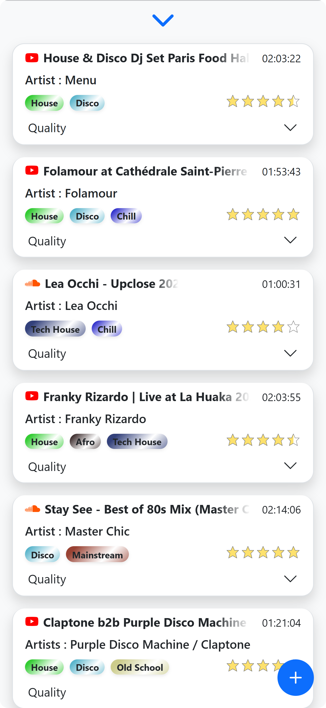
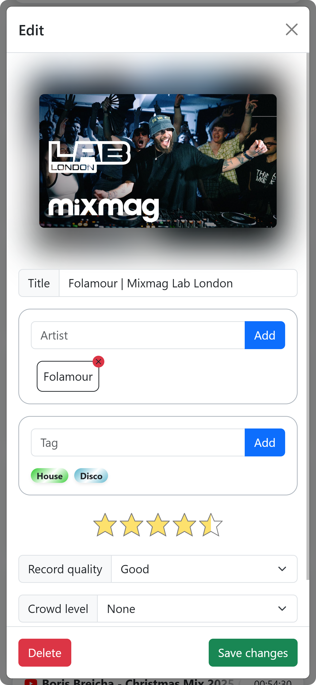
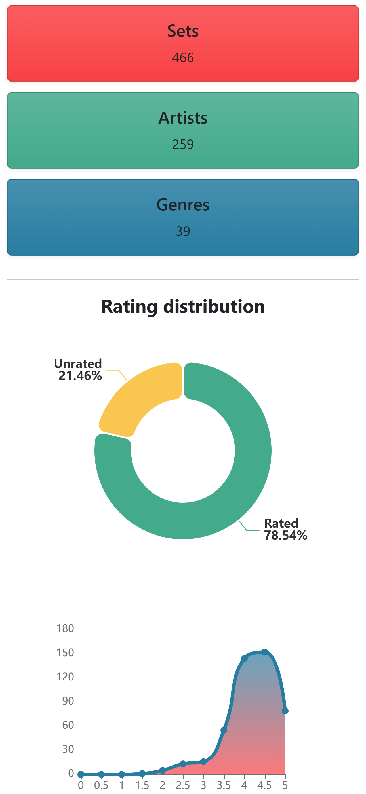

<picture>
    
</picture>

Create, manage and share your music library with Soundset.

## ✨ Key Features

- **Automated Metadata Fetching**: Easily add sets by simply pasting a SoundCloud or YouTube URL. The system automatically retrieves titles, durations, release dates, and thumbnails.
- **Advanced Search**: Search your library by artist, title, tags, keywords, and more.
- **Library Management**: 
  - Tagging system for easy discovery.
  - Artist relationship management.
  - Detailed ratings (Record Quality, Crowd Level, Artist Talking).
  - Import/Export library.
- **Statistical Dashboards**: Visualize your collection with dynamic charts and insights on artists, platforms, and quality metrics.
- **Security & Performance**:
  - Integrated **Fail2ban** configurations for enhanced security.
  - **ProxyFix** middleware for accurate client IP tracking behind reverse proxies like Nginx.
  - SQLite backends for lightweight data management.

## 🚀 Getting Started

### Prerequisites

- Python 3.8+
- [YouTube Data API v3 Key](https://console.cloud.google.com/apis/library/youtube.googleapis.com) (for YouTube metadata)
  - [How to get a YouTube Data API v3 Key](https://developers.google.com/youtube/v3/getting-started)

### Installation

1.  **Clone the repository**:
    ```bash
    git clone https://github.com/BountyBurger/Soundset.git
    cd soundset
    ```

2.  **Install dependencies**:
    ```bash
    pip install -r requirements.txt
    ```

3.  **Configure Environment**:
    Copy `.env.example` to `.env` in the root directory and set the variables:
    ```env
    HTTP_PORT=8080
    YOUTUBE_API_KEY='<your_api_key_here>'
    DB_REPO_PATH='db_repo'
    DBMS_PATH='dbms.db'
    TOKEN_LIFESPAN=180000
    ```

### Usage

Start the development server:
```bash
python run.py
```
The application will be accessible at `http://localhost:8080`.

<picture>
    
    
    
</picture>


### PWA
You can install the application on any device as a PWA by clicking on the "Install Soundset" in the navbar.

## 🛡️ Security Configuration

### Fail2ban Integration
Custom configurations are provided in `config/fail2ban/`. These are designed to monitor `logs/soundset.log` for bruteforce attempts on login and registration endpoints, especially targeting the database management endpoints. The application uses `Werkzeug`'s `ProxyFix` middleware. If you are running this behind a proxy, ensure you set the `X-Forwarded-For` and `X-Forwarded-Proto` headers in your proxy config or the incoming public ip address will not be tracked.

### Disclaimer

This application is still in development and may contains bugs and vulnerabilities. For now I would recommend to not expose it to the public.

## 📋 Roadmap
- [x] Import/Export library
- [ ] Improve security (SQL injection, XSS, CSRF)
- [ ] Add more platforms
- [ ] Add a tutorial popup after library creation
- [ ] Add a dark mode
- [ ] Change the primary color to orange
- [ ] Dockerize the application
- [ ] Reduce external libraries usage
- [ ] Implement a discovery platform to find more music of a specific genre